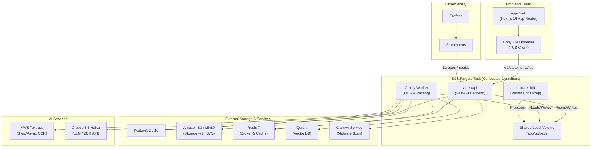
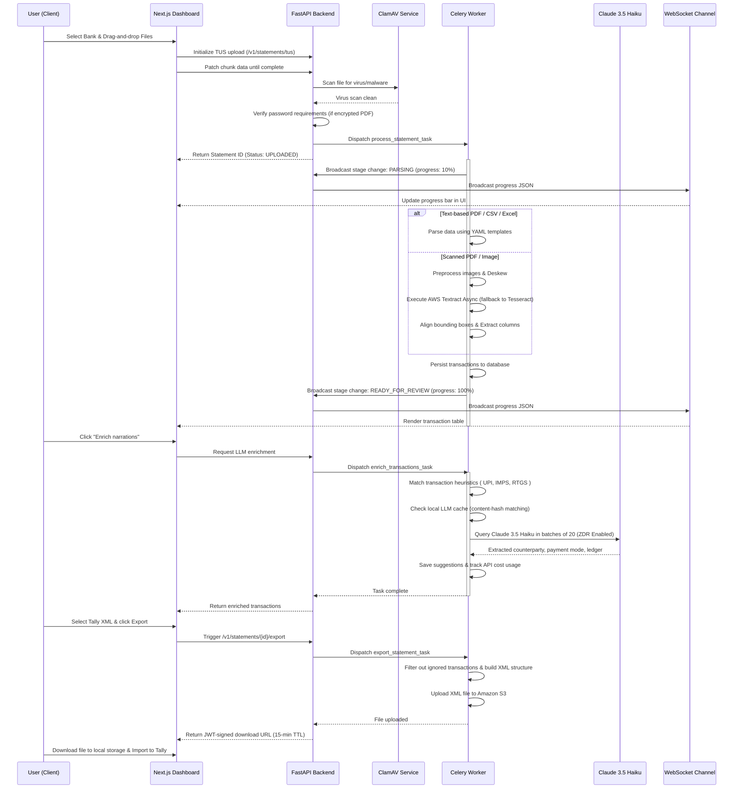

# 🏦 Bank Statement Extraction & Ledger Mapping Pipeline

An AI-powered document extraction pipeline that transforms raw bank statements (PDFs, Excel spreadsheets, CSVs, or scanned images) into clean, structured ledger data ready for double-entry bookkeeping platforms like **Tally Prime**.

> **Multi-tenant SaaS** architecture supporting 30 Indian banks, with intelligent OCR (AWS Textract + Tesseract fallback), background processing (Celery), resilient resumable uploads (TUS 1.0.0), LLM-powered narration enrichment (Claude 3.5), and real-time WebSocket progress tracking.

---

## 📑 Table of Contents

- [Features](#-features)
- [Architecture & Workflow](#-architecture--workflow)
- [Tech Stack](#-tech-stack)
- [Supported Banks](#-supported-banks)
- [Getting Started](#-getting-started)
  - [Prerequisites](#prerequisites)
  - [Local Infrastructure (Docker)](#1-local-infrastructure-docker-compose)
  - [Backend Setup](#2-backend-setup)
  - [Celery Background Worker Setup](#3-celery-background-worker-setup)
  - [Frontend Setup](#4-frontend-setup)
- [API Reference](#-api-reference)
- [OCR Engines](#-ocr-engines)
- [Bank Templates](#-bank-templates)
- [Authentication, Security & Compliance](#-authentication-security--compliance)
- [Database Schema](#-database-schema)
- [Export Formats](#-export-formats)
- [LLM Enrichment & Heuristics](#-llm-enrichment--heuristics)
- [Testing & Quality Assurance](#-testing--quality-assurance)
- [Deployment](#-deployment)
- [Monitoring & Alerts](#-monitoring--alerts)
- [Windows Setup](#-windows-setup)
- [Project Structure](#-project-structure)
- [Roadmap](#-roadmap)
- [License](#-license)

---

## ✨ Features

| Category | Capabilities |
|---|---|
| **Document Intake** | Upload PDF (text-based & scanned), Excel (.xlsx/.xls), CSV, and image files. Supports password-protected PDFs. |
| **Resumable Uploads** | Integrates **TUS 1.0.0 protocol** for robust, chunked uploads. Supports pausing, resuming, and auto-retrying large files. |
| **Multi-File Client** | Uppy-powered Next.js interface for selecting and batch-uploading up to 10 files simultaneously. |
| **Background Processing** | Asynchronous parsing, OCR, narration enrichment, and data exporting run on co-located **Celery** workers. |
| **Smart Parsing** | Template-driven extraction for 30 Indian banks + generic heuristic fallback for unknown formats. |
| **OCR Pipeline** | Three-tier OCR: AWS Textract (sync & async) with automatic local Tesseract fallback. |
| **Malware Protection** | ClamAV scanning integration on all uploaded files before queuing statement parsing. |
| **AI Enrichment** | Claude 3.5 Haiku narration parsing — extracts counterparty, payment mode, and ledger suggestions with Zero Data Retention (ZDR). |
| **Ledger Memory** | Learns from user corrections; uses Qdrant vector similarity for intelligent, context-aware ledger suggestions. |
| **Multi-Tenant** | Firm → User → Client hierarchy with role-based access control (RBAC: owner / admin / member / viewer). |
| **Auth System** | Email OTP, Twilio SMS OTP, JWT access tokens with short TTL, and secure token refresh helpers. |
| **Real-Time Updates** | WebSocket-powered OCR progress and parsing status updates. |
| **Exports** | CSV, Excel, JSON, and Tally Prime XML with signed download URLs. Automatically filters out ignored transactions. |
| **GA Readiness Tools** | PII masking filters in logging, automated security scans, regression validators, and accuracy evaluators. |
| **Cost Protection** | Automated AWS scale-down Lambda function triggered by CloudWatch billing alarms when cost thresholds are breached. |

---

## 🏗️ Architecture & Workflow

### Infrastructure Diagram



### Complete End-to-End Workflow



---

## 🛠️ Tech Stack

### Backend App ([apps/api](file:///Users/gouthamnaroju/Desktop/ref/Bank_statement_scanner/apps/api))

- **Framework**: FastAPI (Asynchronous endpoints, Router isolation) + Uvicorn
- **Task Queue**: Celery (Distributing long-running parsing, exports, and LLM calls)
- **Database**: PostgreSQL 16 (Production) / SQLite (Development) + SQLAlchemy 2.0 (Async) + Alembic
- **Resumable Uploads**: TUS 1.0.0 protocol implementation
- **Malware Protection**: ClamAV daemon integrations
- **Object Storage**: Amazon S3 (Production with KMS encryption) / MinIO (Local Dev)
- **Caching & Broker**: Redis 7
- **Vector Search Database**: Qdrant (Optional, powers ledger suggestion logic)
- **Security & Cryptography**: PyJWT (HS256) + Argon2id (Password hashing)
- **OCR Engine Layer**: AWS Textract (Sync & Async client) + pytesseract + pdf2image + OpenCV (Deskew & thresholding)
- **LLM Enrichment**: Anthropic Claude 3.5 Haiku (Zero Data Retention compliant, Tool-use JSON parsing, exponential backoff)

### Frontend App ([apps/web](file:///Users/gouthamnaroju/Desktop/ref/Bank_statement_scanner/apps/web))

- **Framework**: Next.js 16 (App Router, Standalone build) + React
- **Upload Library**: Uppy Core + Tus client (Pause, Resume, Retry UI)
- **State Management**: Zustand (Client auth stores & layout preferences)
- **Server Cache**: TanStack React Query (Automatic caching, polling, and invalidation)
- **UI Library**: Shadcn UI + Radix UI primitives + Tailwind CSS 4
- **Form Management**: React Hook Form + Zod (Validation schemas)
- **Document Viewing**: react-pdf + PDF.js bounding-box integrations
- **Data Rendering**: TanStack Table (Filtering, Sorting, Ignored Transaction toggles)

### Infrastructure & Operations ([infra](file:///Users/gouthamnaroju/Desktop/ref/Bank_statement_scanner/infra))

- **Deployment**: AWS ECS Fargate (ARM64 tasks), AWS RDS (PostgreSQL), AWS ElastiCache (Redis), AWS CloudFront (CDN)
- **Task Co-location**: Colocating `api` and `celery` containers in a single ECS Task definition to share an ephemeral Docker volume for temporary uploads, boosting speed and bypasses expensive S3 writes for staging.
- **Cost Protection**: CloudWatch billing alarm paired with an AWS Lambda script to scale ECS service counts down to 0 automatically upon cost spikes.
- **Monitoring**: Prometheus scrape instrumentation + Grafana dash configurations.

---

## 🏛️ Supported Banks

The pipeline parses statements for **30 Indian banks** using optimized YAML configurations:

| # | Bank | Template Code | Regression | # | Bank | Template Code | Regression |
|---|---|---|---|---|---|---|---|
| 1 | AU Small Finance Bank | `au_small_finance` | ✅ | 16 | IDFC First Bank | `idfc_first` | ✅ |
| 2 | Axis Bank | `axis` | ✅ | 17 | Indian Bank | `indian_bank` | ✅ |
| 3 | Bandhan Bank | `bandhan` | ✅ | 18 | IndusInd Bank | `indusind` | ✅ |
| 4 | Bank of Baroda | `bank_of_baroda` | ✅ | 19 | Indian Overseas Bank | `iob` | ✅ |
| 5 | Bank of India | `bank_of_india` | ✅ | 20 | Jammu & Kashmir Bank | `jkb` | ✅ |
| 6 | Bank of Maharashtra | `boma` | ✅ | 21 | Karur Vysya Bank | `karur_vysya` | ✅ |
| 7 | Canara Bank | `canara` | ✅ | 22 | Kotak Mahindra Bank | `kotak` | ✅ |
| 8 | Central Bank of India | `cbi` | ✅ | 23 | Punjab National Bank | `pnb` | ✅ |
| 9 | City Union Bank | `city_union` | ✅ | 24 | Punjab & Sind Bank | `punjab_and_sind_bank` | ✅ |
| 10 | Dhanlaxmi Bank | `dhanlaxmi` | ✅ | 25 | RBL Bank | `rbl` | ✅ |
| 11 | Equitas Small Finance | `equitas` | ✅ | 26 | State Bank of India | `sbi` | ✅ |
| 12 | Federal Bank | `federal` | ✅ | 27 | South Indian Bank | `south_indian_bank` | ✅ |
| 13 | HDFC Bank | `hdfc` | ✅ | 28 | UCO Bank | `uco` | ✅ |
| 14 | ICICI Bank | `icici` | ✅ | 29 | Union Bank of India | `union_bank` | ✅ |
| 15 | IDBI Bank | `idbi` | ✅ | 30 | Yes Bank | `yes_bank` | ✅ |

> **Heuristic Auto-Fallback:** If a uploaded file does not match any known template pattern, the parser triggers the `generic_parser.py` ruleset to statistically extract transaction tables.

---

## 🚀 Getting Started

### Prerequisites

- **Python** 3.12+
- **Node.js** 18+ (npm 10+)
- **Docker Desktop** (local database, redis, clamav, qdrant infrastructure)
- **Tesseract OCR** (local scanned processing fallback)
- **Poppler** (PDF-to-image extraction)

---

### 1. Local Infrastructure (Docker Compose)

Launch backing servers:
```bash
cd infra
docker compose up -d
```
This spawns:
- **PostgreSQL 16** (`localhost:5432`)
- **Redis 7** (`localhost:6379`)
- **MinIO** (`localhost:9000` / Console `localhost:9001`)
- **Qdrant Vector DB** (`localhost:6333`)
- **ClamAV Antivirus Daemon** (`localhost:3310`)
- **Prometheus** (`localhost:9090`)
- **Grafana** (`localhost:3001`)

---

### 2. Backend Setup

Configure environmental variables:
```bash
cd apps/api
cp .env.example .env
```
Ensure you update `.env` with valid AWS credentials, SMTP configs, and keys.

Setup python virtual environment and run the FastAPI server:
```bash
python -m venv venv
source venv/bin/activate       # On Linux/macOS
# venv\Scripts\activate        # On Windows

pip install -r requirements.txt
python main.py
```
FastAPI Swagger documentation will be available at **http://localhost:8000/docs**.

---

### 3. Celery Background Worker Setup

Start the Celery worker process locally:
```bash
cd apps/api
source venv/bin/activate
celery -A core.celery_app.celery_app worker --loglevel=INFO --concurrency=2
```

---

### 4. Frontend Setup

Install Next.js dependencies and start the app:
```bash
cd apps/web
npm install
npm run dev
```
Open **http://localhost:3000** in your browser.

---

## 📡 API Reference

Base endpoint: `http://localhost:8000`

### Resumable Uploads via TUS (`/v1/statements/tus`)

- `OPTIONS /v1/statements/tus/{uid}`: Retrieve supported TUS features, upload sizes, and extensions.
- `POST /v1/statements/tus`: Create an upload resource. Set metadata headers (`Upload-Metadata: filename X, bankcode Y, password Z`).
- `HEAD /v1/statements/tus/{uid}`: Retrieve current chunk upload progress (Upload-Offset and length).
- `PATCH /v1/statements/tus/{uid}`: Upload raw binary chunk content. Triggers antivirus, validation checks, and launches parser worker upon completion.
- `DELETE /v1/statements/tus/{uid}`: Cancel upload and wipe temporary binary fragments from disk.

### Statements & Review (`/v1/statements`)

- `GET /v1/statements`: Paginated, filtered list of statement uploads.
- `GET /v1/statements/{id}/status`: Current parsing lifecycle.
- `GET /v1/statements/{id}/result`: Extracted transaction rows.
- `PATCH /v1/statements/{id}/status`: Manually set review status.
- `POST /v1/statements/{id}/transactions/enrich`: Trigger heuristics + Claude enrichment.
- `POST /v1/statements/{id}/export`: Initiate background exporter job.
- `GET /v1/exports/{id}/download`: Get download token (signed MinIO/S3 URL).

---

## 🔍 OCR Engines

When statement processing falls back to scanned document paths, the engine dynamically decides the execution path:

```
                  [OCR_ENGINE config]
                           │
             ┌─────────────┼─────────────┐
             ▼             ▼             ▼
       "tesseract"    "textract"      "auto"
             │             │             │
             │             ▼             ▼
             │      [Async Enabled?]  [Verify AWS STS Credentials]
             │        ┌────┴────┐        ┌──────┴──────┐
             │       Yes        No      Valid        Invalid
             │        ▼         ▼        ▼             ▼
             │     Textract  Textract  [Async?]    Tesseract
             │      Async      Sync    ┌──┴──┐
             │                        Yes   No
             │                         ▼    ▼
             │                     Textract Textract
             │                      Async   Sync
             ▼                        │       │
      TesseractEngine <───────────────┴───────┘
                     (On AWS failure fallback)
```

1. **Textract Async**: Offloads parsing of large documents (10+ pages) to an S3 staging workflow.
2. **Textract Sync**: Evaluated for single/small page documents.
3. **Tesseract Engine**: Runs locally using custom preprocessing steps:
   - **Bimodal Histogram Contrast Detection** to flag low-quality scans.
   - **Deskewing** using horizontal projection profile variance.
   - **Adaptive Thresholding** to remove noisy scanning grid artifacts.
   - **Morphological Grid Extraction** for cell-by-cell targeted character recognition.

---

## 📋 Bank Templates

Bank statement parsers use bank configurations managed in [packages/bank-templates/](file:///Users/gouthamnaroju/Desktop/ref/Bank_statement_scanner/packages/bank-templates).

### Template Format Example (`hdfc.yaml`)

```yaml
bank_code: "HDFC"
bank_name: "HDFC Bank Ltd."
type: "pdf_text"
fingerprint:
  keywords: ["HDFC BANK", "Statement of Account"]
  regex: ["IFSC\\s*:\\s*HDFC000[0-9]{4}"]
extraction:
  headers: ["Date", "Narration", "Chq./Ref.No.", "Value Dt", "Withdrawal Amt.", "Deposit Amt.", "Closing Balance"]
  columns:
    date: 0
    narration: 1
    reference: 2
    value_date: 3
    debit: 4
    credit: 5
    balance: 6
  formats:
    date: "%d/%m/%y"
    number: "indian"
```

- **Live Reloading**: An active directory listener (`template_watcher.py`) hot-reloads bank configurations on file modifications in development and production environments.
- **Admin Controls**: Dedicated `/admin/banks/reload/all` API reload triggers.

---

## 🔐 Authentication, Security & Compliance

- **Zero Data Retention (ZDR)**: Integrated with Anthropic's ZDR standard headers (`"anthropic-beta": "zero-data-retention"`). Statement data processed by Claude 3.5 is never saved, cached, or used for model fine-tuning.
- **PII Masking**: Custom logging filter (`log_filter.py`) intercepts audit logs and masks personal identifiers (emails, phone numbers, banking account numbers, API keys) using regex patterns.
- **ClamAV Anti-Malware**: Scans every upload. Suspicious files raise an immediate validation error (HTTP 422) and are deleted.
- **Multi-Tenant RLS**: Row-Level Security matches user memberships with Firm identifiers (`firm_id`). Users cannot access, download, or edit files of another firm.
- **Argon2id Hashing**: High-entropy password encryption protecting stored login records.
- **Signed URL Expiry**: S3 download links expire in 15 minutes.

---

## 🗄️ Database Schema

The entity relationship maps accounts, firms, clients, statements, and transaction fields:

```
   ┌─────────┐             ┌───────────────┐             ┌───────────┐
   │  Firms  │────────────o│ Firm_Members  │o────────────│   Users   │
   └─────────┘             └───────────────┘             └───────────┘
        │
        │
        ▼
   ┌───────────┐           ┌───────────────┐             ┌──────────────┐
   │  Clients  │──────────o│  Statements   │────────────o│ Transactions │
   └───────────┘           └───────────────┘             └──────────────┘
                                   │                             │
                                   ├────────────────┐            ├───────────────┐
                                   ▼                ▼            ▼               ▼
                             ┌───────────┐    ┌──────────┐  ┌──────────────┐┌──────────────┐
                             │Export_Jobs│    │LLM_Usage │  │Ledger_Suggest││Ledger_Mapping│
                             └───────────┘    └──────────┘  └──────────────┘└──────────────┘
```

- **Statements lifecycle**: `UPLOADED` ➔ `PARSING` ➔ `READY_FOR_REVIEW` ➔ `EXPORTED` (with `FAILED` error states).
- **Audit Logs**: Logs actions, IPs, and actions taken across endpoints.

---

## 📤 Export Formats

- **Tally Prime XML**: Built to match double-entry rules. Maps inputs into Ledger Voucher imports (`ENVELOPE/BODY/TALLYMESSAGE`).
- **Excel**: Multi-tab formatting containing original document metadata and detailed lists.
- **CSV**: UTF-8 encoded files containing all verification confidence rates.
- **Ignored Transaction Handling**: Transactions flagged as `ignored = true` are excluded from the exported spreadsheets and Tally XML ledger entries. Totals calculations are adjusted accordingly.

---

## 🤖 LLM Enrichment & Heuristics

The transaction classifier integrates a smart hybrid workflow:

1. **Regex Heuristic Rules**: Fast patterns check for common modes like UPI (`/UPI/.*`), IMPS, RTGS, Cash, and Card, and extract target counterparties.
2. **Claude 3.5 AI Batch Mode**: Unresolved narrations are batched in groups of 20 to save tokens.
3. **Structured Outputs**: Claude's Tool Use API forces responses to parse as a rigid JSON schema, removing parser failures.
4. **Token Cost-Tracking**: Logs incoming and outgoing token numbers and maps pricing estimates in the dashboard.
5. **Content-Hash Caching**: Identical narrations are cached in `llm_cache`. If hit, the system reads suggestions without making Anthropic calls.
6. **Hallucination Detection**: Compares Claude's ledger suggestions against the client's imported Tally chart of accounts. If the ledger is not in the system, it flags the transaction with a warning.
7. **Recurring Txn Detector**: Analyzes transaction cycles (dates, amount similarity, narration keywords) to flag repeating operations (e.g. rent, salaries, loan EMIs).

---

## 🧪 Testing & Quality Assurance

All verification commands are executed from the backend directory (`apps/api`) or frontend directory (`apps/web`).

### 1. Pytest Unit Tests
Executes unit tests covering auth validation, template configuration, OCR engines, and export layouts.
```bash
cd apps/api
source venv/bin/activate
pytest tests/ -v
```

### 2. Bank Template Regression Suite
Verifies YAML configurations against expected transaction data structure:
```bash
cd apps/api
pytest tests/test_phase6_part_d_regression.py -v
```

### 3. Bank Template Coverage Report
Generates a template validation summary:
```bash
cd apps/api
python core/generate_coverage_report.py
```
*Outputs details to `apps/api/coverage_report.json`.*

### 4. Automated Security Auditor Scan
Validates security defaults including SQLi injection risk, dependency security checks, and cross-firm isolation:
```bash
cd apps/api
python core/run_security_scan.py
```
*Creates `security_report.md` at project root.*

### 5. Extraction Accuracy Evaluator
Compares parsed results against gold statement configurations:
```bash
cd apps/api
python core/eval_extraction.py
```
*Outputs evaluation score data to `accuracy_report.json`.*

### 6. LLM Categorization Evaluator
Measures Claude mapping accuracy against benchmark narrations:
```bash
cd apps/api
python core/eval_categorization.py
```
*Writes scores to `llm_accuracy_report.json`.*

### 7. Performance Load Tests (k6 / Locust)
Runs HTTP and WebSocket load tests:
```bash
# Using k6 locally
k6 run ../e2e/load_test.js
```
*Generates details in `load_test_report.md`.*

---

## 🚢 Deployment

### ECS Fargate Configuration

Deployments are orchestrated via Terraform (`infra/terraform`).

- **Task Layout**: The ECS API Task definition packs two essential containers: `api` (Uvicorn app) and `celery` (Background tasks), plus `uploads-init`.
- **Shared Volume**: They mount an ephemeral Docker volume `uploads` on `/app/uploads`. This allows the API to store uploaded statement fragments locally, and Celery to process them directly, avoiding S3 roundtrips during parsing.
- **Resource Allocation**: Shared CPU is set to 2048 (2 vCPUs) and Memory is set to 4096 (4 GB) to give OCR processing sufficient resources.

### Auto-Scale Cost Protection

A custom Lambda function ([infra/billing_shutdown_lambda.py](file:///Users/gouthamnaroju/Desktop/ref/Bank_statement_scanner/infra/billing_shutdown_lambda.py)) protects against runaway cloud charges:
1. **Trigger**: An AWS CloudWatch billing alarm fires when expenses breach a set threshold.
2. **Action**: Fires an SNS notification that triggers the Lambda function.
3. **Execution**: The Lambda queries all ECS services in the active cluster and scales the desired tasks down to 0, immediately halting further infrastructure costs.

---

## 📊 Monitoring & Alerts

- **Prometheus Metrics**: fastapi-instrumentation exports request counts, errors, database connection counts, and processing latency via `GET /metrics`.
- **Alert Rules**: Prometheus Alertmanager rules in `infra/prometheus_alerts.yml` trigger if statement extraction failure rates exceed 5% within a 5-minute sliding window.
- **Grafana Dashboard**: Access locally at `http://localhost:3001` (user/pass: `admin/admin`) to monitor latency, CPU limits, database size, and LLM expenses.

---

## 🪟 Windows Setup

Windows configurations require extra steps to run backend utilities natively:

> [!TIP]
> Running the backend within **Docker Desktop** is highly recommended to avoid local dependencies.

### Step-by-Step Native Setup

1. **C++ Build Tools**: Required by `argon2-cffi`. Install VS Build Tools and select "Desktop development with C++".
2. **Tesseract OCR**: Download installer from UB-Mannheim and append path to your system's Environment Variables.
3. **Poppler**: Extract Poppler binaries to a local folder (e.g. `C:\poppler`) and append `C:\poppler\Library\bin` to PATH.
4. **Local Running**:
   ```powershell
   # Launch DB, Redis, etc
   cd infra
   docker compose up -d

   # Start backend API
   cd ..\apps\api
   python -m venv venv
   venv\Scripts\activate
   pip install -r requirements.txt
   python main.py
   ```

---

## 📁 Project Structure

```
Bank_statement_scanner/
├── apps/
│   ├── api/                          # FastAPI Backend Application
│   │   ├── auth/                     #   Auth flows, OTP, JWT helpers
│   │   │   └── dependencies.py       #     Auth dependency injection & JWT decoding
│   │   ├── core/                     #   Core engine files & utilities
│   │   │   ├── antivirus.py          #     ClamAV antivirus connector
│   │   │   ├── bank_loader.py        #     Loads YAML configurations
│   │   │   ├── bank_regression.py    #     Runs bank template parsing checks
│   │   │   ├── celery_app.py         #     Celery application bootstrap config
│   │   │   ├── config.py             #     Pydantic environment config settings
│   │   │   ├── eval_categorization.py#     Narration categorizer benchmarking script
│   │   │   ├── eval_extraction.py    #     Statement parsing benchmarking script
│   │   │   ├── generate_coverage.py  #     Generates bank template coverage report
│   │   │   ├── generic_parser.py     #     Statistical parser for untemplated statements
│   │   │   ├── job_progress.py       #     Progress tracker helper
│   │   │   ├── log_filter.py         #     PII data logger masking script
│   │   │   ├── metrics.py            #     Custom Prometheus metrics definitions
│   │   │   ├── pii_masker.py         #     PII redaction utility
│   │   │   └── run_security_scan.py  #     Automated project vulnerability scanner
│   │   ├── db/                       #   Database configuration and schemas
│   │   ├── exports/                  #   Exporters API endpoints
│   │   ├── statements/              #   Statement uploading & processing
│   │   │   ├── parser.py            #     Template parsing engine
│   │   │   ├── ocr_worker.py        #     AWS Textract & Tesseract OCR pipelines
│   │   │   ├── processing.py        #     Celery asynchronous task definitions
│   │   │   ├── tus_router.py        #     TUS chunked resumable upload endpoints
│   │   │   ├── rules_engine.py      #     Pattern matching engine
│   │   │   └── websocket.py         #     WebSocket connection managers
│   │   ├── main.py                   #   FastAPI entry application
│   │   └── requirements.txt          #   Python backend dependencies
│   │
│   └── web/                          # Next.js Frontend Application
│       ├── src/
│       │   ├── app/                  #   React App Router pages
│       │   ├── components/           #   Shared React components
│       │   │   ├── UppyUploader.tsx  #     TUS resumable uploader component
│       │   │   └── PDFViewer.tsx     #     Interactive PDF viewer with box highlights
│       │   └── lib/                  #   Utilities & API integrations
│       │       └── auth.ts           #     Token helpers & automatic token renewal
│       └── package.json              #   Frontend dependencies
│
├── packages/
│   ├── bank-templates/               # 30 bank statement template configuration files (YAML)
│   ├── schemas/                      # Shared JSON validation schemas
│   └── tally-xml/                    # Tally import generation logic
│
├── workers/                          # Distributed workers
│   └── parser/                       # Parsing experiments
│
├── infra/                            # Infrastructure and Deployment configurations
│   ├── terraform/                    # AWS Infrastructure as Code (ECS, S3, RDS, IAM)
│   │   └── ecs.tf                    #   ECS Cluster, service & task specifications
│   ├── docker-compose.yml            # Local developer cluster (Postgres, Redis, ClamAV)
│   ├── billing_shutdown_lambda.py    # Auto-scale cost protection Lambda function
│   ├── db_backup.sh                  # Backup utility script
│   ├── deploy.sh                     # Unix/macOS build & deployment orchestrator
│   └── prometheus_alerts.yml         # Prometheus alerting alert configurations
│
├── e2e/                              # E2E & load test suites
│   └── load_test.js                  # Locust/k6 load test script
│
├── deploy_api.ps1                    # API deployment automation script (PowerShell)
└── README.md                         # ← You are here
```

---

## 🎯 Roadmap

### Completed ✅
- [x] Multi-bank PDF / CSV / Excel parsing (30 Indian banks)
- [x] Resumable chunked file uploads (TUS 1.0.0 protocol implementation)
- [x] Colocated ECS Fargate architecture (Shared fast `/app/uploads` volume)
- [x] Background processing queues (Celery integration for parsing, enrichment, and exports)
- [x] Three-tier OCR pipeline (Tesseract + Textract sync/async fallback)
- [x] AI-powered narration enrichment (Claude 3.5 Haiku + heuristics)
- [x] LLM cost tracking & content-hash caching
- [x] Email OTP + phone OTP (Twilio) user authentication
- [x] Real-time updates (WebSocket connection streams)
- [x] Exports (CSV, Excel, JSON, and double-entry Tally XML)
- [x] Ignored transactions filtering
- [x] Zero Data Retention (ZDR) configuration for Anthropic API
- [x] Hallucinated ledger warnings and recurring transaction cycles detection
- [x] PII data masking in application logging
- [x] ClamAV malware screening
- [x] AWS KMS storage encryption integration
- [x] Automated cost limits scale-down (CloudWatch + Lambda)
- [x] Regression testing suite & QA evaluation metrics (Extraction & LLM)
- [x] Prometheus metrics + Grafana monitoring dashboard


---

## 📄 License

This project is proprietary. All rights reserved.
