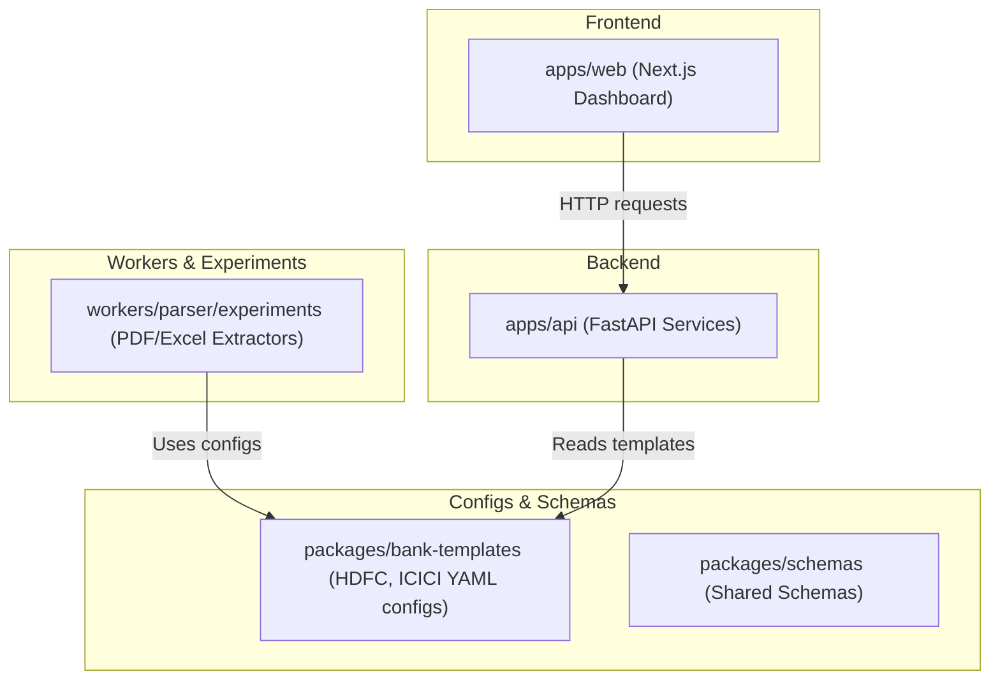

# Bank Statement Extraction & Ledger Mapping Pipeline

An AI-powered document extraction pipeline that transforms raw bank statements (PDFs, Excel spreadsheets, CSVs, or images) into clean, structured ledger data ready for double-entry bookkeeping platforms like Tally.

---

## 🏗️ Repository Architecture

The project is structured as a monorepo, separating frontend, backend, workers, and shared packages:



### Directory Tour

- **[`apps/api`](file:///d:/Bank_statement/apps/api)**: FastAPI backend application. Manages API routes, SQLAlchemy ORM databases, authentication, and core business logic.
- **[`apps/web`](file:///d:/Bank_statement/apps/web)**: Next.js (App Router) web interface, designed with a premium glassmorphic UI, dealing with auth flows (signup, login) and firm dashboards.
- **[`packages/bank-templates`](file:///d:/Bank_statement/packages/bank-templates)**: Shared YAML configuration templates for fingerprinting bank statements and mapping tabular columns (e.g., [HDFC](file:///d:/Bank_statement/packages/bank-templates/hdfc.yaml), [ICICI](file:///d:/Bank_statement/packages/bank-templates/icici.yaml)).
- **[`packages/schemas`](file:///d:/Bank_statement/packages/schemas)**: Intended for shared JSON/Pydantic schemas used across multiple packages and apps.
- **[`workers/parser`](file:///d:/Bank_statement/workers/parser)**: Python-based asynchronous workers and parser scripts for OCR and text processing.
- **[`docs`](file:///d:/Bank_statement/docs)**: Architectural designs, flow diagrams, and feature specs.

---

## 🛠️ Tech Stack & Dependencies

### Backend API (`apps/api`)
- **Web Framework:** FastAPI (Uvicorn server)
- **Database ORM:** SQLAlchemy (Asyncio driver)
- **Database Engine:** SQLite (local development `bank_statements.db`) or PostgreSQL
- **Migrations:** Alembic
- **Caching/Task Queues:** Redis
- **Storage:** Amazon S3 / MinIO (for secure statement PDF/Excel uploads)
- **Auth:** PyJWT (JSON Web Tokens) with Argon2 password hashing
- **Environment:** `python-dotenv` for secure secret configs

### Frontend Web (`apps/web`)
- **Framework:** Next.js 15+ (App Router)
- **Language:** TypeScript
- **Styling:** Tailwind CSS & Glassmorphism styles
- **Component Library:** Radix UI / Shadcn UI

### Statement Parsers (`workers/parser`)
- **Libraries:** `pdfplumber`, `pandas`, `pyyaml` for template parsing.

---

## 🚀 Getting Started

Follow these steps to set up and run the environment locally.

> **Windows users**: See the [Windows Setup](#-windows-setup) section below before
> running any of these steps.

### 1. Backend Setup

1. **Navigate to the API folder:**
   ```bash
   cd apps/api
   ```

2. **Set up a Python Virtual Environment:**
   ```bash
   python -m venv venv
   # On Windows:
   venv\Scripts\activate
   # On macOS/Linux:
   source venv/bin/activate
   ```

3. **Install Dependencies:**
   ```bash
   pip install -r requirements.txt
   ```

4. **Environment Configuration:**
   Create a `.env` file in `apps/api/` (refer to `apps/api/.env.example`) with settings like:
   ```env
   DATABASE_URL=sqlite+aiosqlite:///./bank_statements.db
   REDIS_URL=redis://localhost:6379/0
   S3_ENDPOINT=http://localhost:9000
   S3_ACCESS_KEY=minioadmin
   S3_SECRET_KEY=minioadmin123
   S3_BUCKET=bank-statements
   JWT_SECRET_KEY=your-secure-secret-key
   API_HOST=127.0.0.1
   API_PORT=8000
   DEBUG=True
   CORS_ORIGINS=http://localhost:3000
   ```

5. **Run the Database Migrations / Initialize DB:**
   The application initializes the SQLite database tables automatically on startup via `db/database.py`.

6. **Start the FastAPI Dev Server:**
   ```bash
   python main.py
   # Or run manually with uvicorn:
   uvicorn main:app --reload --port 8000
   ```
   *Access API Interactive Docs at: `http://localhost:8000/docs`*

---

### 2. Frontend Setup

1. **Navigate to the Web folder:**
   ```bash
   cd apps/web
   ```

2. **Install Node dependencies:**
   ```bash
   npm install
   ```

3. **Run the Next.js dev server:**
   ```bash
   npm run dev
   ```
   *Access Web Application at: `http://localhost:3000`*

---

### 3. Local Infrastructure (Docker Compose)

PostgreSQL, Redis, MinIO (S3), Qdrant, Prometheus and Grafana can be started
with a single command. Docker Desktop is required.

```bash
cd infra
docker compose up -d
```

---

## 🪟 Windows Setup

Windows requires a few extra steps before the backend will run natively.

> **Easiest option**: Run the API inside Docker Desktop (Linux container).
> The `Dockerfile` installs all system dependencies automatically.
> Only `apps/web` needs to run natively (`npm run dev`).

### Step-by-step for native Python on Windows

#### 1 — Install Microsoft C++ Build Tools
Required to compile `argon2-cffi` (password hashing library).

1. Download: https://visualstudio.microsoft.com/visual-cpp-build-tools/
2. Run the installer → select **"Desktop development with C++"**
3. Restart your terminal after install

#### 2 — Install Tesseract OCR
Required by `pytesseract` (scanned PDF processing).

1. Download installer: https://github.com/UB-Mannheim/tesseract/wiki
   - File: `tesseract-ocr-w64-setup-*.exe`
2. Install it (default path: `C:\Program Files\Tesseract-OCR\`)
3. Add to PATH: open **System Properties → Environment Variables → Path → Edit**
   → add `C:\Program Files\Tesseract-OCR\`
4. Verify: open a new terminal → `tesseract --version`

#### 3 — Install Poppler
Required by `pdf2image` (PDF-to-image conversion for OCR).

1. Download: https://github.com/oschwartz10612/poppler-windows/releases
   - File: `Release-*.zip`
2. Extract to e.g. `C:\poppler\`
3. Add to PATH: add `C:\poppler\Library\bin`
4. Verify: open a new terminal → `pdfinfo --version`

#### 4 — Start infrastructure with Docker Compose
```powershell
cd infra
docker compose up -d
```

#### 5 — Run the API
```powershell
cd apps\api
python -m venv venv
venv\Scripts\activate
pip install -r requirements.txt
python main.py
```

#### 6 — Run the Frontend
```powershell
cd apps\web
npm install
npm run dev
```

### Deploying from Windows
Use the PowerShell deploy script instead of the bash one:
```powershell
# Deploy everything (API + Web → ECR → ECS)
.\infra\deploy.ps1

# Deploy API only
.\deploy_api.ps1
```

---


### 3. Running Parser Experiments

You can experiment with PDF parser configurations in `workers/parser/experiments/`.

1. **Activate Python Virtual Environment & Install parser requirements:**
   ```bash
   cd workers/parser/experiments
   pip install -r requirements.txt
   ```

2. **Execute the experiment script:**
   Specify a bank template id (e.g. `hdfc` or `icici`) and path to a sample statement:
   ```bash
   python pdf_experiment.py <bank_id> <path_to_pdf>
   # Example:
   python pdf_experiment.py hdfc sample_hdfc_stmt.pdf
   ```

---

## 📖 Database Schema & Ledger Mapping Concept

The database schema (defined in [`apps/api/db/models.py`](file:///d:/Bank_statement/apps/api/db/models.py)) models the entire business logic:
- **`Firms` & `Users`**: Enables multi-tenant SaaS accounting firm structures.
- **`Clients`**: Individual clients belonging to accounting firms.
- **`Statements`**: Records uploaded statements, tracking parsing states (`UPLOADED`, `PARSING`, `READY_FOR_REVIEW`, `EXPORTED`).
- **`Transactions`**: Holds individual transaction rows extracted from statements, linking to counterparty, payment modes (UPI, NEFT, CHEQUE, etc.), and ledger info.
- **`LedgerMappings`**: Learns and matches transaction narratives (e.g., regex/wildcards on narration) to suggest ledgers automatically over time.
- **`Ledgers`**: Client-specific accounting charts matching Tally ledger structure.

---

## 🎯 Future Work Roadmap

If you are taking over this repository, here is what is next on the roadmap:
1. **Parser Implementation**: Integrate `pdf_experiment.py` into a background worker task using Redis & Celery/arq.
2. **S3 File Upload Pipeline**: Wire up statement upload button in [`apps/web/src/app/dashboard/page.tsx`](file:///d:/Bank_statement/apps/web/src/app/dashboard/page.tsx) to upload to MinIO/S3 and trigger the parser.
3. **Transaction Table View**: Build the React data-grid in the dashboard to review, categorize, ignore, or edit suggested ledgers.
4. **Tally Exporter**: Write exporter package to generate XML ledger entries readable by Tally Prime.
