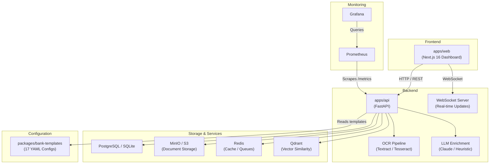
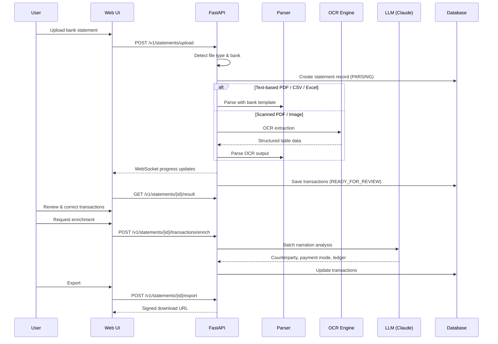
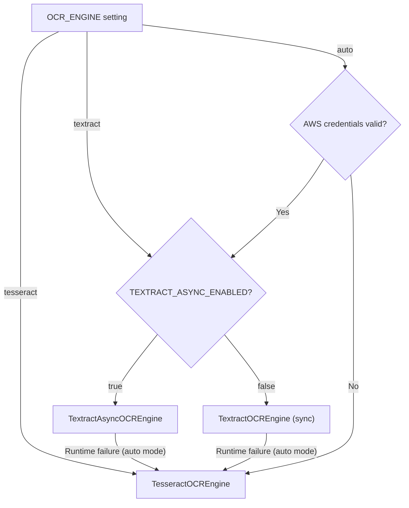
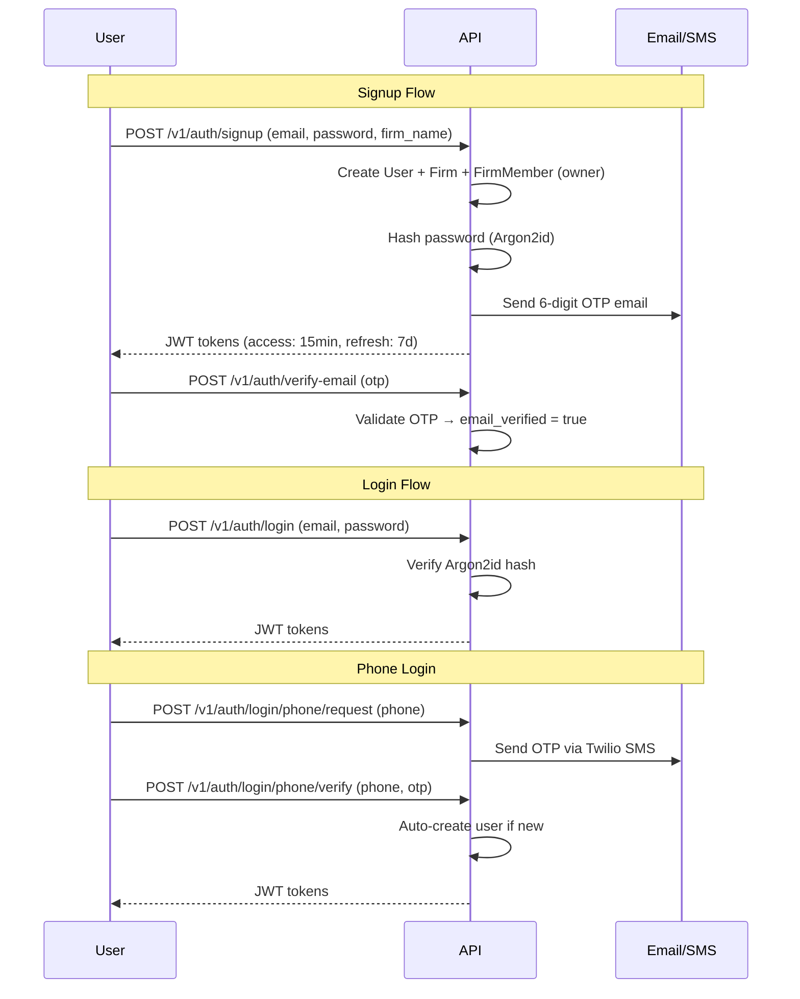
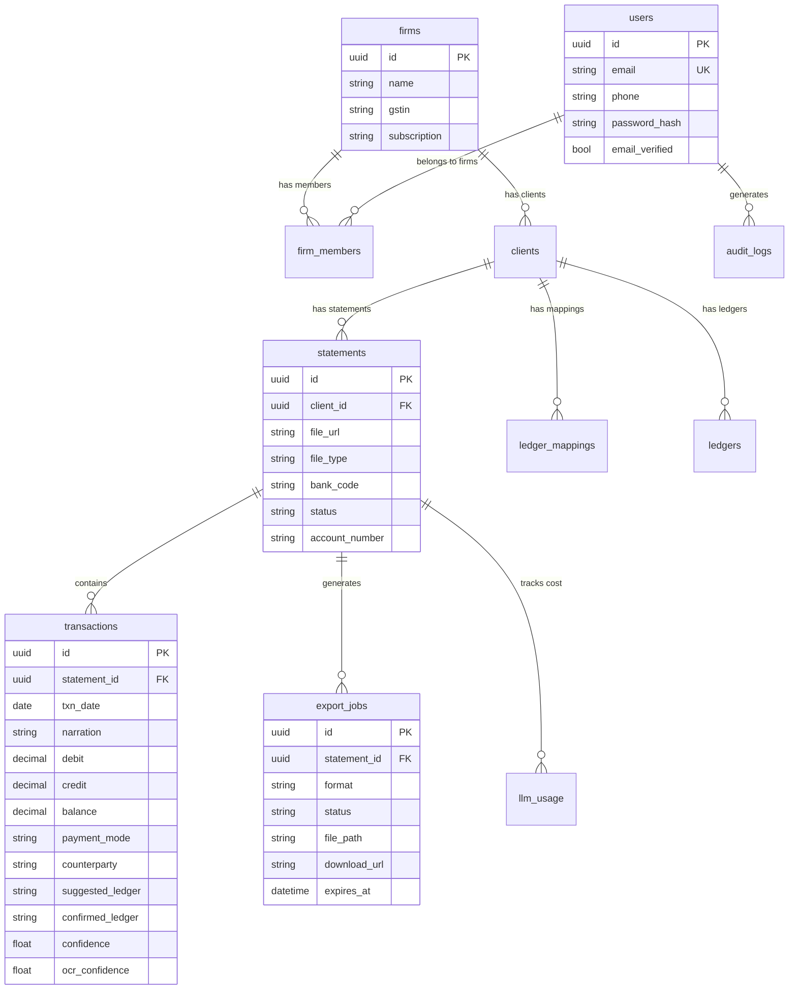

# 🏦 Bank Statement Extraction & Ledger Mapping Pipeline

An AI-powered document extraction pipeline that transforms raw bank statements (PDFs, Excel spreadsheets, CSVs, or scanned images) into clean, structured ledger data ready for double-entry bookkeeping platforms like **Tally Prime**.

> **Multi-tenant SaaS** architecture supporting 17 Indian banks, with intelligent OCR (AWS Textract + Tesseract fallback), LLM-powered narration enrichment (Claude), and real-time WebSocket progress tracking.

---

## 📑 Table of Contents

- [Features](#-features)
- [Architecture](#-architecture)
- [Tech Stack](#-tech-stack)
- [Supported Banks](#-supported-banks)
- [Getting Started](#-getting-started)
  - [Prerequisites](#prerequisites)
  - [Backend Setup](#1-backend-setup)
  - [Frontend Setup](#2-frontend-setup)
  - [Local Infrastructure](#3-local-infrastructure-docker-compose)
- [API Reference](#-api-reference)
- [OCR Engines](#-ocr-engines)
- [Bank Templates](#-bank-templates)
- [Authentication & Security](#-authentication--security)
- [Database Schema](#-database-schema)
- [Export Formats](#-export-formats)
- [LLM Enrichment](#-llm-enrichment)
- [Testing](#-testing)
- [Deployment](#-deployment)
- [Monitoring](#-monitoring)
- [Windows Setup](#-windows-setup)
- [Project Structure](#-project-structure)
- [Roadmap](#-roadmap)
- [License](#-license)

---

## ✨ Features

| Category | Capabilities |
|---|---|
| **Document Intake** | Upload PDF (text-based & scanned), Excel (.xlsx/.xls), CSV, and image files |
| **Smart Parsing** | Template-driven extraction for 17 banks + generic heuristic fallback for unknown formats |
| **OCR Pipeline** | Three-tier OCR: AWS Textract (sync & async) with automatic Tesseract fallback |
| **AI Enrichment** | Claude-powered narration parsing — extracts counterparty, payment mode, and ledger suggestions |
| **Ledger Memory** | Learns from user corrections; optional Qdrant vector similarity for intelligent ledger suggestions |
| **Multi-Tenant** | Firm → User → Client hierarchy with role-based access (owner / admin / member / viewer) |
| **Auth System** | Email OTP verification, phone OTP (Twilio), JWT tokens, Argon2id password hashing |
| **Real-Time Updates** | WebSocket-powered OCR progress and parsing status updates |
| **Exports** | CSV, Excel, JSON, and Tally Prime XML with signed download URLs |
| **Admin Panel** | Bank template CRUD, hot-reload, cache management, regression testing dashboard |
| **Monitoring** | Prometheus metrics + Grafana dashboards out of the box |
| **LLM Cost Tracking** | Per-statement token usage, content-hash caching to minimize API spend |

---

## 🏗️ Architecture



### Request Flow



---

## 🛠️ Tech Stack

### Backend (`apps/api`)

| Component | Technology |
|---|---|
| **Framework** | FastAPI with Uvicorn |
| **Database ORM** | SQLAlchemy 2.x (Async) |
| **Database** | SQLite (dev) / PostgreSQL 16 (prod) |
| **Object Storage** | MinIO (dev) / Amazon S3 (prod) |
| **Cache / Queues** | Redis 7 |
| **Vector Store** | Qdrant (optional, for ledger memory) |
| **Auth** | PyJWT (HS256) + Argon2id password hashing |
| **PDF Parsing** | pdfplumber (text) + pdf2image + pytesseract (scanned) |
| **OCR** | AWS Textract (sync + async) / Tesseract with OpenCV |
| **AI/LLM** | Anthropic Claude 3.5 Haiku (tool-use mode) |
| **Email** | aiosmtplib (dev) / Amazon SES (prod) |
| **SMS** | Twilio (phone OTP) |
| **Metrics** | prometheus-fastapi-instrumentator |
| **Config** | pydantic-settings + `.env` files |

### Frontend (`apps/web`)

| Component | Technology |
|---|---|
| **Framework** | Next.js 16 (App Router, Standalone) |
| **Language** | TypeScript |
| **UI Library** | Shadcn UI + Radix UI primitives |
| **Styling** | Tailwind CSS 4 |
| **Data Grid** | TanStack React Table |
| **PDF Viewer** | react-pdf / pdfjs-dist |
| **Icons** | Lucide React |

### Infrastructure

| Component | Technology |
|---|---|
| **Containerization** | Docker + Docker Compose |
| **Cloud Provider** | AWS (ECS Fargate, RDS, ElastiCache, S3, CloudFront, SES) |
| **IaC** | Terraform |
| **Monitoring** | Prometheus + Grafana |
| **CI/CD** | PowerShell / Bash deploy scripts |

---

## 🏛️ Supported Banks

The pipeline ships with pre-configured YAML templates for **17 Indian banks**:

| # | Bank | Template Code | Regression Tested |
|---|---|---|---|
| 1 | AU Small Finance Bank | `au_small_finance` | ✅ |
| 2 | Axis Bank | `axis` | ✅ |
| 3 | Bank of Baroda | `bank_of_baroda` | ✅ |
| 4 | Bank of India | `bank_of_india` | ✅ |
| 5 | Canara Bank | `canara` | ✅ |
| 6 | Central Bank of India | `cbi` | ✅ |
| 7 | Federal Bank | `federal` | ✅ |
| 8 | HDFC Bank | `hdfc` | ✅ |
| 9 | ICICI Bank | `icici` | ✅ |
| 10 | IDFC First Bank | `idfc_first` | ✅ |
| 11 | IndusInd Bank | `indusind` | ✅ |
| 12 | Kotak Mahindra Bank | `kotak` | ✅ |
| 13 | Punjab National Bank | `pnb` | ✅ |
| 14 | RBL Bank | `rbl` | ✅ |
| 15 | State Bank of India | `sbi` | ✅ |
| 16 | Union Bank of India | `union_bank` | ✅ |
| 17 | Yes Bank | `yes_bank` | ✅ |

> **Unknown banks?** The generic heuristic parser automatically detects date, narration, debit, credit, and balance columns using pattern matching and statistical analysis.

---

## 🚀 Getting Started

### Prerequisites

| Requirement | Version | Notes |
|---|---|---|
| **Python** | 3.12+ | Backend API |
| **Node.js** | 18+ | Frontend |
| **Docker Desktop** | Latest | Local infrastructure (PostgreSQL, Redis, MinIO, etc.) |
| **Tesseract OCR** | 5.x | Optional — only needed if not using AWS Textract |
| **Poppler** | Latest | Required for scanned PDF → image conversion |

### 1. Backend Setup

```bash
# Navigate to the API directory
cd apps/api

# Create and activate virtual environment
python -m venv venv
source venv/bin/activate        # macOS / Linux
# venv\Scripts\activate         # Windows

# Install dependencies
pip install -r requirements.txt
```

**Configure environment variables** — copy the example and edit:

```bash
cp .env.example .env
```

Key settings in `.env`:

```env
# ─── Database ────────────────────────────────────────────────
DATABASE_URL=sqlite+aiosqlite:///./bank_statements.db

# ─── OCR Engine ──────────────────────────────────────────────
# Options: "auto" (recommended), "textract", "tesseract"
OCR_ENGINE=auto

# ─── AWS Credentials (for Textract & S3) ─────────────────────
AWS_ACCESS_KEY_ID=your-access-key
AWS_SECRET_ACCESS_KEY=your-secret-key
AWS_DEFAULT_REGION=ap-south-1
TEXTRACT_REGION=ap-south-1

# ─── JWT ─────────────────────────────────────────────────────
JWT_SECRET_KEY=change-this-in-production

# ─── Email (for OTP) ─────────────────────────────────────────
SMTP_HOST=smtp.gmail.com
SMTP_PORT=587
SMTP_USERNAME=your-email@gmail.com
SMTP_PASSWORD=your-app-password
SMTP_FROM_EMAIL=your-email@gmail.com
```

> [!WARNING]
> **Never commit `.env` files to version control.** They contain secrets like AWS credentials, JWT keys, and email passwords. The `.gitignore` should already exclude them.

**Start the API server:**

```bash
python main.py
# Or with hot-reload:
uvicorn main:app --reload --port 8000
```

Access the interactive API docs at: **http://localhost:8000/docs**

---

### 2. Frontend Setup

```bash
# Navigate to the web directory
cd apps/web

# Install Node dependencies
npm install

# Start the Next.js dev server
npm run dev
```

Access the web application at: **http://localhost:3000**

> [!NOTE]
> The frontend proxies API requests via Next.js rewrites. By default, it forwards `/api/*` to `http://127.0.0.1:8000`. Configure the `API_URL` environment variable to change this.

---

### 3. Local Infrastructure (Docker Compose)

Start all backing services with a single command:

```bash
cd infra
docker compose up -d
```

This launches:

| Service | Port | Purpose |
|---|---|---|
| **PostgreSQL 16** | 5432 | Primary database |
| **Redis 7** | 6379 | Cache & task queues |
| **MinIO** | 9000 / 9001 (console) | S3-compatible object storage |
| **Qdrant** | 6333 / 6334 | Vector similarity (ledger memory) |
| **Prometheus** | 9090 | Metrics collection |
| **Grafana** | 3001 | Monitoring dashboards |

---

### 4. Running Parser Experiments

Test PDF parsing independently:

```bash
cd workers/parser/experiments
pip install -r requirements.txt
python pdf_experiment.py <bank_id> <path_to_pdf>

# Example:
python pdf_experiment.py hdfc sample_hdfc_stmt.pdf
```

---

## 📡 API Reference

Base URL: `http://localhost:8000`

### Health & Info

| Method | Endpoint | Description |
|---|---|---|
| `GET` | `/health` | Health check |
| `GET` | `/` | Service info |

### Authentication (`/v1/auth`)

| Method | Endpoint | Description |
|---|---|---|
| `POST` | `/v1/auth/signup` | Register user + create firm |
| `POST` | `/v1/auth/login` | Email/password login → JWT tokens |
| `POST` | `/v1/auth/verify-email` | Verify email with 6-digit OTP |
| `POST` | `/v1/auth/resend-otp` | Resend verification OTP (rate-limited) |
| `POST` | `/v1/auth/forgot-password` | Initiate password reset |
| `POST` | `/v1/auth/reset-password` | Reset password via OTP |
| `POST` | `/v1/auth/refresh` | Refresh JWT token pair |
| `POST` | `/v1/auth/login/phone/request` | Request phone OTP (Twilio) |
| `POST` | `/v1/auth/login/phone/verify` | Verify phone OTP + auto-create user |
| `GET` | `/v1/auth/me` | Get current user profile |

### Statements (`/v1/statements`)

| Method | Endpoint | Description |
|---|---|---|
| `POST` | `/v1/statements/upload` | Upload statement (PDF/CSV/Excel/image) |
| `GET` | `/v1/statements` | List statements (paginated, filtered) |
| `GET` | `/v1/statements/{id}/status` | Get parsing status |
| `GET` | `/v1/statements/{id}/result` | Get parsed transactions |
| `GET` | `/v1/statements/{id}/file` | Download original uploaded file |
| `PATCH` | `/v1/statements/{id}/status` | Update statement status |
| `DELETE` | `/v1/statements/{id}` | Delete statement + associated files |

### Transactions (`/v1/statements/{id}/transactions`)

| Method | Endpoint | Description |
|---|---|---|
| `GET` | `/v1/statements/{id}/transactions` | List transactions (paginated, filtered) |
| `PUT` | `/v1/statements/{id}/transactions/{txId}` | Update single transaction |
| `POST` | `/v1/statements/{id}/transactions/bulk-update` | Bulk update transactions |
| `POST` | `/v1/statements/{id}/transactions/enrich` | LLM / heuristic enrichment |
| `GET` | `/v1/statements/{id}/transactions/{txId}/ledger-suggestions` | Get ledger suggestions |
| `GET` | `/v1/statements/{id}/llm-usage` | LLM cost tracking |

### Exports (`/v1/statements/{id}/export`)

| Method | Endpoint | Description |
|---|---|---|
| `POST` | `/v1/statements/{id}/export` | Create export (CSV/Excel/JSON/Tally XML) |
| `GET` | `/v1/statements/{id}/exports` | List exports for a statement |
| `GET` | `/v1/exports/{id}/download` | Download export (signed URL, 15min TTL) |
| `DELETE` | `/v1/exports/{id}` | Delete an export |

### Admin — Bank Templates (`/admin/banks`)

| Method | Endpoint | Description |
|---|---|---|
| `GET` | `/admin/banks` | List all bank templates |
| `GET` | `/admin/banks/{code}` | Get specific bank template |
| `POST` | `/admin/banks` | Upload new YAML bank template |
| `PATCH` | `/admin/banks/{code}` | Update bank template |
| `DELETE` | `/admin/banks/{code}` | Delete bank template |
| `GET` | `/admin/banks/{code}/download` | Download template YAML file |
| `POST` | `/admin/banks/reload/all` | Force reload all templates |
| `POST` | `/admin/banks/{code}/reload` | Reload specific template |
| `GET` | `/admin/banks/cache/stats` | Template cache statistics |
| `DELETE` | `/admin/banks/cache/clear` | Clear template cache |

### Admin — QA & Regression (`/admin/banks/qa`)

| Method | Endpoint | Description |
|---|---|---|
| `GET` | `/admin/banks/qa/coverage` | Regression test coverage report |
| `GET` | `/admin/banks/qa/regression` | Run full regression suite |
| `GET` | `/admin/banks/qa/failure-alerts` | Extraction failure alerts |

### WebSocket

| Protocol | Endpoint | Description |
|---|---|---|
| `WS` | `/v1/ws/statements/{id}` | Real-time parsing status & OCR progress |

---

## 🔍 OCR Engines

The pipeline provides three OCR backends with intelligent, config-driven selection:



### Engine Comparison

| Engine | Class | Use Case | File Limit | Accuracy |
|---|---|---|---|---|
| **Tesseract** | `TesseractOCREngine` | Free, local, offline | Unlimited | Good |
| **Textract Sync** | `TextractOCREngine` | Fast cloud OCR | ≤ 10 MB | Excellent |
| **Textract Async** | `TextractAsyncOCREngine` | Large files, S3-based | Unlimited | Excellent |

### Tesseract Pipeline (per page)

1. PDF → PIL images at 300 DPI
2. **Quality detection** — distinguishes screenshots from noisy scans via histogram bimodality + Laplacian variance
3. **Preprocessing** — Otsu threshold (screenshots) or bilateral filter + adaptive threshold (scans)
4. **Deskew** — rotation correction via `minAreaRect`
5. **Table grid detection** — morphological horizontal/vertical line analysis
6. **Cell extraction** — grid found → cell-by-cell OCR (PSM 7); no grid → full-page word clustering (PSM 6)

### Configuration

```env
OCR_ENGINE=auto                 # "auto" | "textract" | "tesseract"
TEXTRACT_REGION=ap-south-1      # AWS region (no leading spaces!)
TEXTRACT_ASYNC_ENABLED=false    # true for S3-based async processing
TEXTRACT_FEATURE_TYPES=TABLES   # comma-separated: TABLES,FORMS
```

> [!IMPORTANT]
> When using `OCR_ENGINE=auto`, the system validates AWS credentials via STS `GetCallerIdentity` before choosing Textract. If credentials are invalid, it silently falls back to Tesseract. If Textract fails at runtime, it also retries with Tesseract automatically.

---

## 📋 Bank Templates

Templates are YAML configuration files in `packages/bank-templates/` that tell the parser how to fingerprint and extract data from each bank's statement format.

### Template Structure

```yaml
bank_code: "HDFC"
bank_name: "HDFC Bank Ltd."
type: "pdf_text"                          # pdf_text | excel | csv
fingerprint:
  keywords: ["HDFC BANK", "Statement of Account"]
  regex: ["IFSC\\s*:\\s*HDFC000[0-9]{4}"]
extraction:
  headers: ["Date", "Narration", "Chq./Ref.No.", "Value Dt", "Withdrawal Amt.", "Deposit Amt.", "Closing Balance"]
  columns:
    date: 0
    narration: 1
    reference: 2
    value_date: 3
    debit: 4
    credit: 5
    balance: 6
  formats:
    date: "%d/%m/%y"
    number: "indian"                      # 1,23,456.78 format
```

### Hot-Reload

Templates support live hot-reloading:
- **Filesystem watcher** polls for changes every 1 second
- **API-triggered reload** via `POST /admin/banks/reload/all` or `POST /admin/banks/{code}/reload`
- Thread-safe `BankTemplateCache` ensures consistency

### Regression Testing

Every template has automated regression validation:
- Generates synthetic CSV from template config
- Parses the CSV and validates ≥ 2 transactions extract correctly
- Coverage reports and failure alerts (threshold: 5%, minimum 20 samples)
- Run via `GET /admin/banks/qa/regression`

---

## 🔐 Authentication & Security

### Auth Flows



### Security Measures

| Mechanism | Implementation |
|---|---|
| **Password Hashing** | Argon2id (memory-hard, side-channel resistant) |
| **JWT Tokens** | HS256 — access: 15 min, refresh: 7 days |
| **OTP Codes** | Cryptographically secure 6-digit, 10-minute expiry |
| **Rate Limiting** | Max 5 OTP requests per hour per email |
| **Email Verification** | Required — unverified users get HTTP 403 |
| **Data Isolation** | All queries scoped to user's firm via firm membership |
| **Export URLs** | JWT-signed download URLs with 15-minute TTL |
| **Audit Logging** | All user actions logged to `audit_logs` table |

---

## 🗄️ Database Schema

The application uses 15 ORM models with UUIDv7 primary keys and `NUMERIC(18,2)` for monetary fields:



### Key Models

| Table | Purpose |
|---|---|
| `firms` | Multi-tenant accounting firm entities |
| `users` | User accounts with email/phone/password |
| `firm_members` | User ↔ Firm linkage with roles (owner / admin / member / viewer) |
| `clients` | Individual clients belonging to accounting firms |
| `statements` | Uploaded statement records with lifecycle status |
| `transactions` | Extracted transaction rows with enrichment data |
| `export_jobs` | Export records (CSV/Excel/JSON/Tally XML) |
| `ledger_mappings` | Learned pattern → ledger associations with hit counts |
| `ledgers` | Client-specific Tally ledger chart |
| `llm_cache` | Content-hash-based LLM response deduplication |
| `llm_usage` | Per-statement LLM cost tracking |
| `audit_logs` | Security audit trail |
| `otp_codes` | Email OTP storage |
| `otps` | Phone OTP storage |
| `password_reset_tokens` | Password reset flow |

### Statement Lifecycle

```
UPLOADED → PARSING → READY_FOR_REVIEW → EXPORTED
                 ↘ FAILED
```

---

## 📤 Export Formats

| Format | Extension | Description |
|---|---|---|
| **CSV** | `.csv` | UTF-8-sig encoded, includes totals row. Columns: Date, Narration, Debit, Credit, Balance, Payment Mode, Counterparty, Ledger, OCR Confidence, Reviewed |
| **Excel** | `.xlsx` | openpyxl-based with statement metadata sheet + transactions |
| **JSON** | `.json` | Structured JSON with full statement metadata + transaction array |
| **Tally XML** | `.xml` | Full Tally Prime import format — `ENVELOPE/HEADER/BODY/TALLYMESSAGE` structure with Payment/Receipt vouchers and double-entry ledger entries |

### Export Features

- **Idempotent** — re-uses existing valid exports for same format
- **Signed URLs** — JWT-based download links with 15-minute TTL
- **Auto-expiry** — exports expire after 24 hours
- **Regeneration** — automatically regenerates on download if file is missing (container-safe)

---

## 🤖 LLM Enrichment

Transaction enrichment uses a **dual pipeline** — fast heuristic rules first, then optional Claude AI for complex narrations:

### Heuristic Enrichment (Free, Instant)

- **Payment mode detection**: Regex patterns for UPI, NEFT, RTGS, IMPS, CHEQUE, CASH, CARD
- **Counterparty extraction**: Pattern matching on narration text
- **Ledger hints**: Rule-based suggestions from common transaction patterns

### Claude AI Enrichment (Anthropic API)

- **Model**: Claude 3.5 Haiku (tool-use mode)
- **Batch processing**: Processes narrations in configurable batch sizes (default: 20)
- **Tool-use format**: Structured output via Claude's tool calling for reliable JSON
- **Confidence scoring**: Quality-based scores from 0.10 to 0.95
- **Cost tracking**: Per-statement token usage with content-hash caching to avoid duplicate API calls
- **Cost estimation**: Configurable rates ($0.80/1M input, $4.00/1M output tokens)

---

## 🧪 Testing

### Unit Tests (16 test files)

```bash
cd apps/api
pytest tests/ -v
```

| Test File | Coverage |
|---|---|
| `test_statements.py` | Upload, status, result endpoints |
| `test_transactions.py` | Transaction CRUD operations |
| `test_ocr_worker.py` | OCR engine unit tests |
| `test_ocr_confidence.py` | Confidence scoring validation |
| `test_ocr_engine_selection.py` | Engine selection logic |
| `test_ocr_table_detection.py` | Table grid detection |
| `test_textract_engine.py` | AWS Textract engine tests |
| `test_export_api.py` | Export endpoint tests |
| `test_exporters.py` | Export format generators |
| `test_tally_xml.py` | Tally XML generation |
| `test_excel_parser.py` | Excel file parsing |
| `test_parser_axis_kotak.py` | Bank-specific parsing |
| `test_bank_templates_phase6.py` | Template validation |
| `test_phase6_part_d_regression.py` | Regression test suite |
| `test_email_service.py` | Email delivery service |

### E2E Tests (Playwright)

```bash
npx playwright test
```

- **Review flow**: Statement review UI + transaction editing
- **Export flow**: Export creation with signed download URLs
- **Delete flow**: Statement deletion
- Uses mocked API routes (no real backend required)

**Configuration** (`playwright.config.ts`):
- Browser: Chromium
- Timeout: 30 seconds
- Screenshots: captured on failure

---

## 🚢 Deployment

### AWS Architecture (Terraform)

The `infra/terraform/` directory contains a full AWS deployment:

| Resource | Configuration |
|---|---|
| **VPC** | Public + private subnets |
| **ECS Fargate** | ARM64 cluster |
| **ECR** | 3 repositories (web, api, parser) |
| **Web Task** | 256 CPU / 512 MB |
| **API Task** | 512 CPU / 1024 MB (higher for OCR/PDF processing) |
| **RDS** | PostgreSQL |
| **ElastiCache** | Redis |
| **S3** | Document storage bucket |
| **CloudFront** | CDN distribution |
| **ALB** | Application Load Balancer with target groups |
| **Cloud Map** | Internal service discovery (DNS) |
| **CloudWatch** | Log groups with 14-day retention |
| **IAM** | Scoped roles for S3 access + SES email |

### Deploy Commands

```bash
# Full deployment (API + Web)
cd infra
./deploy.sh

# API-only deployment
./deploy_api.ps1
```

The deploy script:
1. Authenticates to ECR
2. Builds Docker image
3. Pushes to ECR
4. Registers new ECS task definition
5. Forces new deployment
6. Waits for service stability

### Docker Build

```bash
cd apps/api
docker build -t bank-statement-api .

# Skip Tesseract if using Textract only:
docker build --build-arg INSTALL_TESSERACT=false -t bank-statement-api .
```

---

## 📊 Monitoring

### Prometheus

- Auto-instrumented via `prometheus-fastapi-instrumentator`
- Metrics endpoint: `GET /metrics`
- Config: `docker/prometheus.yml`

### Grafana

- Pre-configured dashboard: `docker/grafana/dashboard.json`
- Access: `http://localhost:3001` (when using Docker Compose)
- Tracks: request rates, latencies, error rates, OCR processing times

---

## 🪟 Windows Setup

Windows requires additional steps before the backend will run natively.

> [!TIP]
> **Easiest option**: Run the API inside Docker Desktop (Linux container). The `Dockerfile` installs all system dependencies automatically. Only `apps/web` needs to run natively (`npm run dev`).

### Step-by-Step for Native Python on Windows

#### 1 — Install Microsoft C++ Build Tools

Required to compile `argon2-cffi` (password hashing library).

1. Download: https://visualstudio.microsoft.com/visual-cpp-build-tools/
2. Run the installer → select **"Desktop development with C++"**
3. Restart your terminal after install

#### 2 — Install Tesseract OCR

Required by `pytesseract` (scanned PDF processing).

1. Download installer: https://github.com/UB-Mannheim/tesseract/wiki
   - File: `tesseract-ocr-w64-setup-*.exe`
2. Install it (default path: `C:\Program Files\Tesseract-OCR\`)
3. Add to PATH: **System Properties → Environment Variables → Path → Edit** → add `C:\Program Files\Tesseract-OCR\`
4. Verify: open a new terminal → `tesseract --version`

#### 3 — Install Poppler

Required by `pdf2image` (PDF-to-image conversion for OCR).

1. Download: https://github.com/oschwartz10612/poppler-windows/releases
   - File: `Release-*.zip`
2. Extract to e.g. `C:\poppler\`
3. Add to PATH: add `C:\poppler\Library\bin`
4. Verify: open a new terminal → `pdfinfo --version`

#### 4 — Start Infrastructure + Run

```powershell
# Infrastructure
cd infra
docker compose up -d

# API
cd apps\api
python -m venv venv
venv\Scripts\activate
pip install -r requirements.txt
python main.py

# Frontend (new terminal)
cd apps\web
npm install
npm run dev
```

#### Deploying from Windows

```powershell
# Full deployment (API + Web → ECR → ECS)
.\infra\deploy.ps1

# API only
.\deploy_api.ps1
```

---

## 📁 Project Structure

```
Bank_statement_scanner/
├── apps/
│   ├── api/                          # FastAPI backend
│   │   ├── auth/                     #   Authentication (signup, login, OTP, JWT)
│   │   ├── core/                     #   Config, bank loader, template watcher, generic parser
│   │   ├── db/                       #   SQLAlchemy models, database setup
│   │   ├── exports/                  #   Export router (CSV, Excel, JSON, Tally XML)
│   │   ├── statements/              #   Statement processing
│   │   │   ├── parser.py            #     Main parser (CSV, Excel, PDF)
│   │   │   ├── ocr_worker.py        #     OCR engines (Tesseract, Textract sync/async)
│   │   │   ├── llm_enrichment.py    #     Claude AI + heuristic enrichment
│   │   │   ├── llm_tracking.py      #     LLM cost tracking & caching
│   │   │   ├── ledger_memory.py     #     Qdrant vector memory for ledger suggestions
│   │   │   ├── websocket.py         #     WebSocket connection manager
│   │   │   └── exporters/           #     Format-specific export generators
│   │   │       ├── csv_exporter.py
│   │   │       ├── excel_exporter.py
│   │   │       ├── json_exporter.py
│   │   │       └── tally_xml.py
│   │   ├── tests/                    #   16 unit test files
│   │   ├── main.py                   #   FastAPI app entry point
│   │   ├── requirements.txt          #   Python dependencies
│   │   ├── Dockerfile                #   Production container
│   │   └── .env.example              #   Environment variable template
│   │
│   └── web/                          # Next.js 16 frontend
│       ├── src/
│       │   ├── app/                  #   App Router pages
│       │   │   ├── dashboard/        #     Main dashboard + review pages
│       │   │   ├── login/            #     Auth pages
│       │   │   ├── signup/
│       │   │   ├── manage/           #     Admin panel
│       │   │   └── guide/            #     Usage guide
│       │   ├── components/           #   React components
│       │   │   ├── TransactionTable.tsx
│       │   │   ├── PDFViewer.tsx
│       │   │   ├── ExportModal.tsx
│       │   │   └── ui/              #     Shadcn UI primitives
│       │   └── lib/                  #   Utilities & API clients
│       ├── package.json
│       └── next.config.ts
│
├── packages/
│   └── bank-templates/               # 17 YAML bank configurations
│       ├── hdfc.yaml
│       ├── icici.yaml
│       ├── sbi.yaml
│       └── ...                       # + 14 more banks
│
├── workers/
│   └── parser/
│       └── experiments/              # Standalone PDF parsing experiments
│           └── pdf_experiment.py
│
├── infra/
│   ├── docker-compose.yml            # Local infrastructure (6 services)
│   ├── terraform/                    # AWS deployment (ECS, RDS, S3, CloudFront)
│   ├── deploy.sh                     # Linux/macOS deploy script
│   └── deploy.ps1                    # Windows deploy script
│
├── docker/
│   ├── prometheus.yml                # Prometheus scrape config
│   └── grafana/
│       └── dashboard.json            # Pre-built Grafana dashboard
│
├── e2e/                              # Playwright E2E tests
│   ├── review-flow.spec.ts
│   └── fixtures/
│
├── docs/                             # Documentation & handoff notes
│   ├── PHASE1_HANDOFF_README.md
│   ├── WINDOWS_SETUP.md
│   └── PROGRESS_REPORT.md
│
├── deploy_api.ps1                    # API-only deploy script
└── README.md                         # ← You are here
```

---

## 🎯 Roadmap

### Completed ✅
- [x] Multi-bank PDF / CSV / Excel parsing (17 banks)
- [x] Three-tier OCR pipeline (Tesseract + Textract sync/async)
- [x] AI-powered narration enrichment (Claude + heuristics)
- [x] Full auth system (email OTP, phone OTP, JWT, Argon2id)
- [x] Multi-tenant firm architecture with RBAC
- [x] Real-time WebSocket progress updates
- [x] Four export formats (CSV, Excel, JSON, Tally XML)
- [x] Admin panel with template management & regression testing
- [x] Prometheus + Grafana monitoring
- [x] AWS Terraform deployment (ECS Fargate)
- [x] Ledger memory with vector similarity (Qdrant)
- [x] LLM cost tracking with content-hash deduplication

### Upcoming 🚧
- [ ] Celery / arq background workers for large file processing
- [ ] Bulk statement upload (zip archives)
- [ ] Client-specific ledger chart import from Tally
- [ ] Multi-language OCR support (Hindi, regional languages)
- [ ] Statement reconciliation across multiple accounts
- [ ] Webhook notifications for processing completion
- [ ] API rate limiting and usage quotas
- [ ] SSO / Google OAuth integration

---

## 📄 License

This project is proprietary. All rights reserved.
